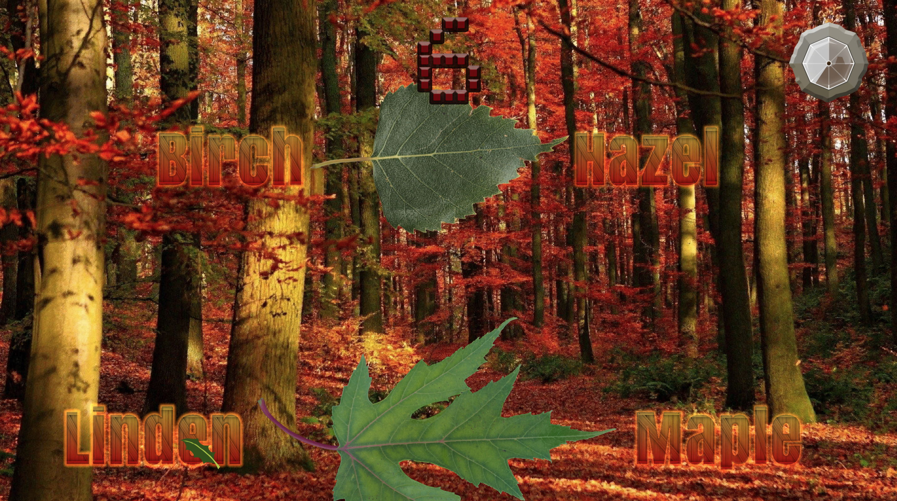

# leafy

A minigame about leaves. The goal is to correctly identify as many falling leaves as possible in one minute.

Play: https://letmaik.github.io/leafy/

For best performance, use Chrome or Edge.

## Feedback

If you are an experienced Unity game dev and notice anything that can be improved (best practices etc.) feel free to open an issue with your suggestions.

## Background

This was my first attempt at creating a game with Unity. The free resources listed below made the game possible. Check them out!

## Resources

Leaf textures:

- https://freecutout.com/category/cut-out-leaves/
- https://texture.ninja/textures/Leaves/4

Other textures:

- http://www.clker.com/clipart-holly-leaf.html
- https://wallpapers.com/wallpapers/orange-forest-fall-season-hd-tatza89mzr3s03ym.html
- https://assetstore.unity.com/packages/2d/gui/icons/elemental-meters-173133

Audio:

- https://freesound.org/people/klankbeeld/sounds/536541/

Code:

- http://wiki.unity3d.com/index.php/AspectRatioEnforcer
- https://github.com/Cysharp/UniTask
